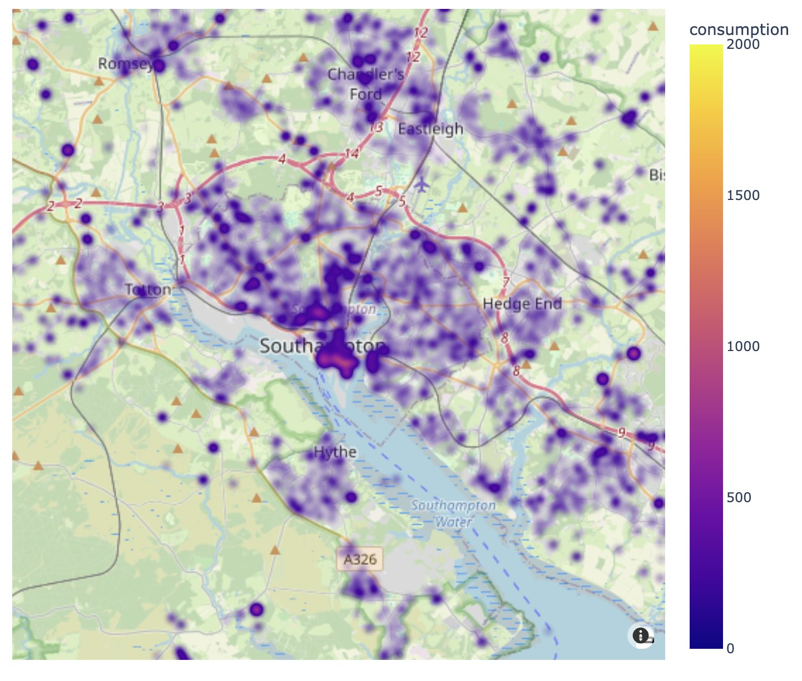

# UK LV Feeder Smart Meter Data

A collection of scripts and documentation to help work with the smart meter data files 
from various UK DNO data portals, covering a range of tasks:

* Downloading data, where it is split into hundreds of small downloads
* Adding missing data, such as SSEN substation locations where it's not present in
  the downloads but can be approximated from other open data
* Combining all of the DNOs data into a single sheet
* Validating the data against a JSON Schema

This was a short project we undertook to get experience working with energy system data
and particularly the newly published smart meter data. We are not data scientists or
analysts, but we want to understand the problems they face. 

Our end goal was simply to explore and understand this data. We tried to make one 
combined dataset across all DNOs for the month of February 2024 (the first month all 
DNOs have data) and visualise the active consumption on a map.

Spolier alert: we succeeded (but it wasn't easy).


You can download the results of our work, with consumption aggregated by substation for 
a single day in February, direct from this repo:
[2024-02-12-aggregated-by-substation.csv.gz](2024-02-12-aggregated-by-substation.csv.gz)

## Setup
To run the code in this repo you need python and poetry installed. We use asdf to manage 
python versions and homebrew to manage other tooling. All the python libraries we used are 
defined in our poetry project definition, so poetry can install them:

```shell
$ poetry install
```

Much of the data wrangling was done on the command line with [qsv](https://github.com/jqnatividad/qsv) 
and I also found [csvlens](https://github.com/YS-L/csvlens) very useful to preview big
files.

## Configuration
National grid's portal requires authentication to download data. To use our 
`national-grid-downloader.py` you will need to create a `.env` file from the 
`.env.example` and paste in your api key from your user profile. Other portals also
need registration, but we downloaded files from those manually.

## Downloading data
Two scripts are provided to help download data that is available in an awkward number of
small files.

```shell
$ poetry run python ssen-downloader.py
$ poetry run python national-grid-downloader.py
```

These are pretty rudimentary, but download progress is printed to the terminal, you can 
cancel with ctrl+c and already downloaded files will be skipped next time you run.

Other files can be downloaded direct from the DNO data portals. The complete set of data
we've worked with can be found at:
* [National Grid](https://connecteddata.nationalgrid.co.uk/dataset/aggregated-smart-meter-data-lv-feeder)
* [Scottish & Southern Electricity Networks](https://data.ssen.co.uk/@ssen-distribution/ssen_smart_meter_prod_lv_feeder)
* [Northern Powergrid](https://northernpowergrid.opendatasoft.com/explore/dataset/aggregated-smart-metering-data/information/)
* [UK Power Networks](https://ukpowernetworks.opendatasoft.com/explore/dataset/ukpn-smart-meter-consumption-lv-feeder/information/)

## Data pipeline
As we explored the data and tried to use it, we found a variety of things we needed to
tweak. It slowly went from a few small tweaks, to a full pipeline of cleansing, 
adjustment and data infilling, so we needed a way to manage that.

We set up a simple folder and naming scheme:
```
/data
    /raw
        /nged
        /npg
        /ssen
        /ukpn
    /staging
        /nged
        /npg
        /ssen
        /ukpn
    /output
```

Then followed a process to ensure things were repeatable and reliable:
1. Raw files are downloaded into the `/raw` folders with their original naming. 
2. Each intermediate step of cleaning and processin g results is saved as a new file in
   `/staging`, first in DNO-specific files then, once combined, in the `/staging` folder
   itself. Files are named like `<n>-2024-02-description.csv` where `n` is incremented 
   with the steps of processing.
3. Finally, output files are saved to `/output`

None of these files are included in this repository - they take up too much space, but
we mention this so that the following steps make sense, and you can recreate them if you
want to.

### Full pipeline
Below are the complete set of commands we ran to download and process the data. This is
mainly presented as an example of the work it takes to go from downloaded data to useful
data, but it might be useful if you want to follow or critique what we did.

NB: The CSVs we're working with here are large! Most of the qsv commands complete in a 
few seconds to a minute, but the python commands to generate substation locations and 
split location columns are much slower, taking minutes to an hour.

```shell
# Download SSEN data
poetry run python ssen-downloader.py
# Download NGED data
poetry run python national-grid-downloader.py
# Download UKPN and NPg data manually

# Concatenate NGED files into one
qsv cat rows data/raw/nged/*.csv > data/staging/nged/1-2024-02-combined.csv
# Tidy up NGED column naming to match other DNOs
qsv safenames data/staging/nged/1-2024-02-combined.csv > data/staging/nged/2-2024-02-safenames.csv
# Fill in some blank dno_alias values
qsv fill --default NGED dno_alias data/staging/nged/2-2024-02-safenames.csv > data/staging/nged/3-2024-02-no-empty-dno-alias.csv
# Fill in some blank dno_name values
qsv fill --default "National Grid Electricity Distribution" dno_name data/staging/nged/3-2024-02-no-empty-dno-alias.csv > data/staging/nged/4-2024-02-no-empty-dno-name.csv
# Put timestamps in proper ISO8601 format
qsv replace --select data_collection_log_timestamp,insert_time,last_modified_time '\s' 'T' data/staging/nged/4-2024-02-no-empty-dno-name.csv > data/staging/nged/5-2024-02-add-iso8601-T.csv

# Rename UKPN columns to match other DNOs
qsv rename dataset_id,dno_name,dno_alias,secondary_substation_id,lv_feeder_id,substation_geo_location,aggregated_device_count_active,primary_consumption_active_import,secondary_consumption_active_import,total_consumption_active_import,aggregated_device_count_reactive,total_consumption_reactive_import,data_collection_log_timestamp,insert_time,last_modified_time data/raw/ukpn/ukpn-feb-2024.csv > data/staging/ukpn/1-2024-02-renamed.csv
# Add in the substation and feeder name columns UKPN data is missing (with null values)
# QSV has to add these at the end and then we rearrange the columns afterwards
qsv enum -c secondary_substation_name --constant "<NULL>" data/staging/ukpn/1-2024-02-renamed.csv > data/staging/ukpn/2-2024-02-add-ss-name.csv
qsv enum -c lv_feeder_name --constant "<NULL>" data/staging/ukpn/2-2024-02-add-ss-name.csv > data/staging/ukpn/3-2024-02-add-lvf-name.csv
qsv select dataset_id-secondary_substation_id,secondary_substation_name,lv_feeder_id,lv_feeder_name,substation_geo_location-last_modified_time data/staging/ukpn/3-2024-02-add-lvf-name.csv > data/staging/ukpn/4-2024-02-standardised.csv

# Concatenate SSEN files
qsv cat rows data/raw/ssen/*.csv > data/staging/ssen/1-2024-02-combined.csv
# Add SSEN substation locations
# Manually download a mapping file from https://www.freemaptools.com/download-uk-postcode-lat-lng.htm 
# to data/raw/ukpostcodes.csv
# Manually download the LV_FEEDER_LOOKUP.csv from SSEN (see above) and put it in 
# data/raw/ssen
poetry run python ssen-substation-location.py data/staging/ssen/1-2024-02-combined.csv data/staging/ssen/2-2024-02-with-substation-locations.csv

# Clean up "NA" values in NPg 
qsv replace '^NA$' '<NULL>' data/raw/npg/NPg_Feeder_February2024.csv > data/staging/npg/1-2024-02-no-na.csv
# Clean up non ISO8601 timestamps
# Because of limitations with QSV's replacement regexes, we have to do this in a few steps
qsv replace --select data_collection_log_timestamp '^(/d/d/d/d-/d/d-/d/d /d/d:/d/d:/d/d).000$' '$1+00:00' data/staging/npg/1-2024-02-no-na.csv > data/staging/npg/2-2024-02-add-timezones.csv
qsv replace --select data_collection_log_timestamp '\s' 'T' data/staging/npg/2-2024-02-add-timezones.csv > data/staging/npg/3-2024-02-add-iso8601-T.csv
qsv replace --select insert_time,last_modified_time '\+00.00' '+00:00' data/staging/npg/3-2024-02-add-iso8601-T.csv > data/staging/npg/4-2024-02-fix-00.00-offsets.csv

# Combine everything into one file
qsv cat rows data/staging/nged/5-2024-02-add-iso8601-T.csv data/staging/ukpn/4-2024-02-standardised.csv data/staging/ssen/2-2024-02-with-substation-locations.csv data/staging/npg/4-2024-02-fix-00.00-offsets.csv > data/staging/1-2024-02-combined.csv

# Split the substation_geo_location into separate lat/lon columns
poetry run python split-geo-location.py data/staging/1-2024-02-combined.csv data/staging/2-2024-02-with-lat-lon.csv

# Remove columns we won't need
qsv select '!/substation_geo_location|secondary_consumption_active_import|aggregated_device_count_reactive|total_consumption_reactive_import/' data/staging/2-2024-02-with-lat-lon.csv > data/staging/3-2024-02-remove-unused.csv

# Replace null consumption with 0.0
qsv fill --default 0.0 primary_consumption_active_import,total_consumption_active_import data/staging/3-2024-02-remove-unused.csv > data/staging/4-2024-02-no-null-consumption.csv

# That's our output file
cp data/staging/4-2024-02-no-null-consumption.csv data/output/2024-02.csv
```

## Validation
To understand the data quality, we used `qsv`'s feature of auto-generating a JSON Schema
to give us something to edit and then validate the data against.

```shell
# Generating a schema from the whole 20GB file would take too much memory, so make a
# smaller sample instead
qsv sample 0.01 data/output/2024-02.csv > data/output/2024-02-1-percent-sample.csv

# Build a JSON Schema
qsv schema --strict-dates data/output/2024-02-1-percent-sample.csv
```

The auto-generated schema fits exactly the data it's generated from and is very strict,
we then edited it to make what we hope is a more useful measure of validity for the whole 
dataset:
* Set 0.0 as the minimum for consumption, remove maximums
* Set 5.0 as the minimum for number of meters, disallow nulls because without this we
  can't normalise consumption
* Set some loose UK bounds on lat/lng (to catch bad locations)
* Reduce down the required fields to bare minimum

With this schema, you can then validate the whole dataset, and qsv will helpfully 
generate not only an error report, but also separate the data into valid and invalid.

```shell
qsv validate data/output/2024-02.csv lv-feeder-smart-meter-schema.json
```

It's interesting to note that with a naive concatenation of the existing files (just
aligning column names and padding missing values) only about 7M of the 99M rows are
valid according to this schema. As you can see in the steps above, there are lots of
small differences in the way data is formatted which make it less than uniform. 

Even when these small differences, and bigger issues like missing locations are ironed
out, we still found ourselves having to discard 1.4M rows of data! There were further 
problems too that we couldn't identify using the schema, like substations with GW of
energy consumption in every half-hour.

## Exploration & Visualisation
In order to visualise the data we used a Jupyter notebook to draw a map with pandas and
plotly. However, the full dataset for Feburary is over 20GB, so it's difficult to work
with. Instead we decided to just focus on a single 24H period, 2024-02-12, which is the
first day we have data for all the DNOs. Because we also want to locate things on a map,
we aggregated the data back up to secondary substations, which also helped reduce the
quantity.

To do this, we switched to processing the data in a SQL database.

NB: This assumes you're running a postgresql server locally which has a database called
`meter_data` that your user can access without a password, adjust accordingly if not.

```shell
# Use qsv to put the data into a postgres database
qsv to postgres postgres://localhost/meter_data data/output/2024-02.csv.valid
# Create some indexes in order to speed up queries (will take a while)
psql -d meter_data -a -f indexes.sql
```

We then ran a query to do the filtering and aggregation, putting the results in a CSV

```shell
psql -d meter_data -a -f aggregated-by-substation.sql
```

This gave us our final output: ~140MB of half-hourly energy consumption from 2024-02-12 
00:30 to 2024-02-13 00:00, for every secondary substation in the dataset.

With that, we could look at it!

Very quickly, we realised that there were some outliers in the data, about 60 
substations, across all DNOs and regions, seem to have got their orders of magnitude
wrong when it comes to consumption, as they're reporting figures as high as 50GW in a 
single half-hour. Even below that, there are some which have 2-60MW which look like they
_could_ be erroneous, but it's harder to tell. In most of the images below, we've
excluded everything above 2MW for the purposes of visualisation.

A look at the detail of the substations we have. They are coloured by the total 
consumption in the selected half-hour.


A closer look at a smaller area, around Southampton, showing the change in consumption
between the middle of the night (00:30) and evening peak demand (19;00).




A heatmap of the whole country over the whole day. Note the outliers aren't filtered in this
one, which skews the data quite a bit, but you can still clearly see noticeable peaks
at expected times across the whole country.

